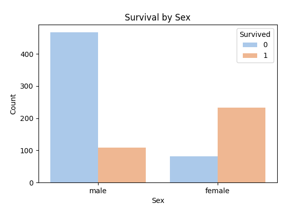
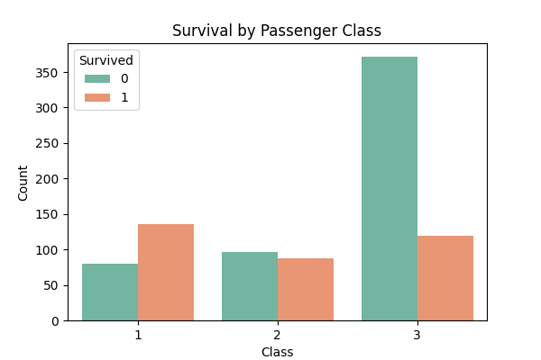
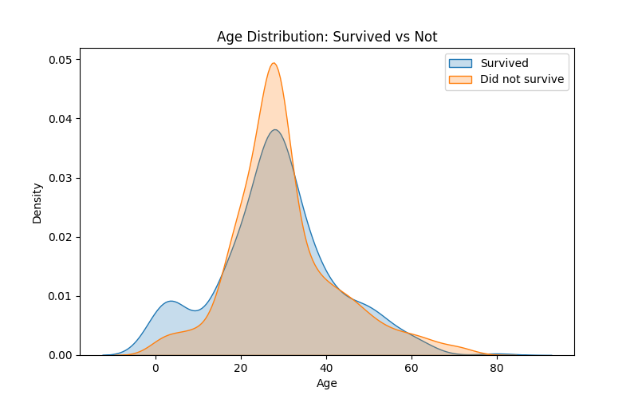
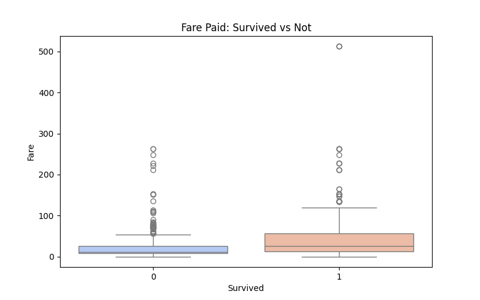
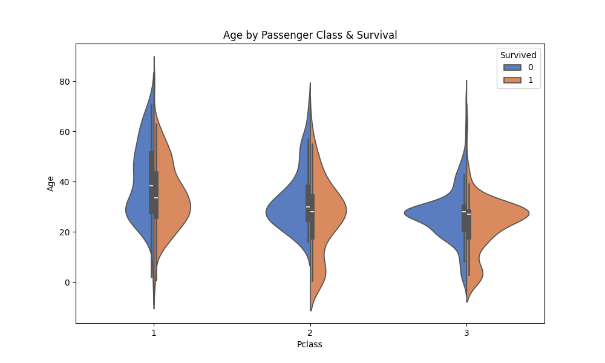
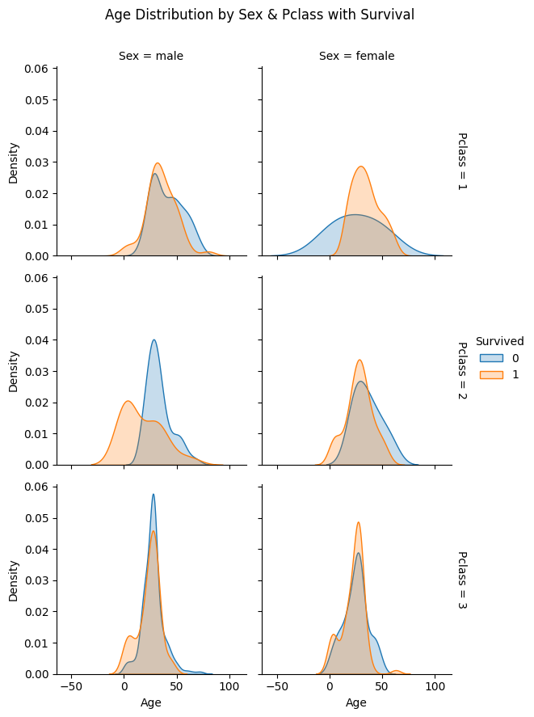

# 🚢 Titanic Dataset Analysis

## 📂 Dataset
This project uses the [Titanic dataset](https://www.kaggle.com/datasets/yasserh/titanic-dataset).  
It contains passenger information such as age, gender, ticket class, fare, number of relatives aboard, and whether they survived the Titanic disaster.

---

## 📊 Visualizations

### 1. Survival by Sex
Shows how gender influenced survival chances.  

### 2. Survival by Passenger Class
Compares survival across 1st, 2nd, and 3rd class passengers.  

### 3. Age Distribution: Survived vs Not
Compares age distributions of survivors and non-survivors.  

### 4. Fare Paid: Survived vs Not
Shows the distribution of fares paid and its relationship to survival.  

### 5. Age by Pclass & Survival (Violin Plot)
Shows how age varied across classes and survival status.  

### 6. Age Distribution by Sex & Pclass with Survival (FacetGrid)
Faceted KDE plots showing combined effect of sex, passenger class, and survival.  

---

## 🔎 Insights
- **Gender effect:** Female passengers had a much higher survival rate than males.  
- **Class effect:** Passengers in 1st class survived more than those in 2nd and 3rd.  
- **Age effect:** Children and younger passengers had better survival rates.  
- **Fare effect:** Higher fares (correlated with class) generally meant better survival chances.  
- **Combined effects:** Being a female in 1st class gave the highest survival probability, while males in 3rd class had the lowest.  

---

## 🧰 Project Files
- `titanic_analysis.ipynb` → Jupyter Notebook with analysis & plots  
- `titanic.csv` → Dataset file  
- `requirements.txt` → Dependencies (pandas, seaborn, matplotlib, jupyter)  
- `README.md` → Documentation  
- `screenshots/` → Saved plot images  

---
